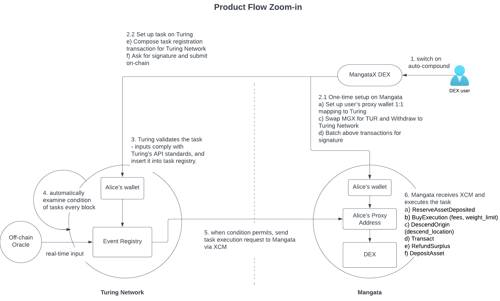

# OAK Network XCM Automation Demos

## Overview


## Installation
1. Install dependencies, `npm i`
1. Run a local Rococo-Mangata-Turing network with instructions in [Run local network with Zombienet](https://github.com/OAK-Foundation/OAK-blockchain#quickstart-run-local-network-with-zombienet)
1. Run a demo by `npm run <file_name>`, defined in package.json.

## Mangata Auto-compound Demo
### Pre-requisites
| Chain      | Version | 
| :---        |    :----:   | 
| Polkadot      | [v0.9.38](https://github.com/paritytech/polkadot/releases/tag/v0.9.38)       |
| OAK-blockchain   | [v1.9.0](https://github.com/OAK-Foundation/OAK-blockchain/releases/tag/v1.9.0)     |
| Mangata-node | [v0.30.0](https://github.com/mangata-finance/mangata-node/pull/501)   |
### Steps & Logs
<details>
<summary>Dev environment</summary>
<br>

1. Launch OAK-blockchain, Rococo and Mangata.

	- Compile oak-collator v1.9.0

		https://github.com/OAK-Foundation/OAK-blockchain/

		```
		cargo build --release --features turing-node --features dev-queue
		```


	- Compile modified Mangata

		https://github.com/mangata-finance/mangata-node/tree/release/v0.30.0

		```
		cargo build --release --features mangata-rococo,fast-runtime
		```


	- Clear the relay chain directory of mangata-node before running zombienet command, because currently mangata-node couldn’t auto-purge.

		```
		./target/release/mangata-node purge-chain
		```

	- Launch zombie in OAK-blockchain project root with modified Mangata and OAK.

		```
		zombie spawn zombienets/turing/mangata.toml
		```

2. Set up accounts and pools
	```
	npm run setup-mangata
	```
3. Run the program to schedule automation and wait for cross-chain execution
   ```
   npm run mangata
   ```
</details>

<details>
<summary>Mangata Rococo environment(Rococo)</summary>
<br>
First, you need to prepare a wallet for the program to run on production environment. Simply export a json file from Mangata Rococo‘s dashboard, name it `seed.json` and place it in the `./private` folder.

Then, run the below command with the pass phrase to unlock the seed.json in order to schedule automation and wait for execution.
```
PASS_PHRASE=<pass_phrase> npm run mangata-rococo
```

Below are the console logs from `npm run mangata-rococo`
```
Initializing APIs of both chains ...
Turing chain name: turing-staging, native token: {"symbol":"TUR","decimals":10}
Mangata chain name: mangata-rococo, native token: {"id":"0","chainId":0,"decimals":18,"name":"Mangata","symbol":"MGR","address":""}

1. Reading token and balance of account ...
[
  {
    tokens: [
      {
        symbol: 'TUR',
        balance: 10187,
        balanceBN: <BN: 5ca85fcf64ae>,
        reserved: 20,
        miscFrozen: 1000,
        feeFrozen: 0
      }
    ],
    chain: 'turing-staging',
    address: '66RxduFvFDjfQjYJRnX4ywgYm6w2SAiHqtqGKgY1qdfYCj3g'
  },
  {
    tokens: [
      {
        symbol: 'MGR',
        id: '0',
        decimals: 18,
        balance: 9953621,
        reserved: 5029,
        frozen: 0
      },
      {
        symbol: 'TUR',
        id: '7',
        decimals: 10,
        balance: 3614268,
        reserved: 0,
        frozen: 0
      }
    ],
    chain: 'mangata-rococo',
    address: '5CM2JyPHnbs81Cu8GzbraqHiwjeNwX3c9Rr5nXkJfwK9fwrk'
  }
]

2. Add a proxy on Mangata for paraId 2114, or skip this step if that exists ...
Found proxy of 5CM2JyPHnbs81Cu8GzbraqHiwjeNwX3c9Rr5nXkJfwK9fwrk on Mangata, and will skip the addition ...  {
  delegate: '5DNrXjfyMuukK3zrMs2T9i2E2VjYfCnA8rCxjk5DDeTeyhtM',
  proxyType: 'AutoCompound',
  delay: 0
}

Account balance check is completed and proxy is set up. Press ENTRE to mint MGR-TUR. yes
Found a pool of MGR-TUR {
  firstTokenId: '0',
  secondTokenId: '7',
  firstTokenAmount: <BN: 87059378c54472fe212d2b>,
  secondTokenAmount: <BN: 4ef251c4f52ea1>,
  liquidityTokenId: '10',
  firstTokenRatio: <BN: 81d4100>,
  secondTokenRatio: <BN: 17bc2ecb00abbf4e0731373b>,
  isPromoted: false,
  firstTokenAmountFloat: <BN: 9bab655>,
  secondTokenAmountFloat: <BN: 21e844>
}
Checking how much reward available in MGR-TUR pool, tokenId: 10 ...
Claimable reward in MGR-TUR:  74
Before auto-compound, 1st Account reserved "MGR-TUR": 1825 ...

Do you want to continue to schedule auto-compound. Press ENTRE to continue. yes

4. Start to schedule an auto-compound call via XCM ...
encodedMangataProxyCall:  0x0500000c720beb3f580f0143f9cb18ae694cddb767161060850025a57a4f72a71bf47501000d080a00000064000000
mangataProxyCallFees:  {
  weight: { refTime: '2,905,398,711', proofSize: '3,716' },
  class: 'Normal',
  partialFee: '27.0780 MGAT'
}

a) Create the call for scheduleXcmpTask 
xcmpCall:  Submittable { initialU8aLength: undefined, registry: TypeRegistry {} }

b) Query automationTime fee details 
automationFeeDetails:  { executionFee: '1.8671 TUR', xcmpFee: '9.5750 TUR' }
TaskId: 0x821644ec6636d29e22a29cef36473c566d0f53681198b58995dfcf48b09bfc9b

c) Sign and send scheduleXcmpTask call ...
Status: Ready
Status: Broadcast
Successful with hash 0x3dc83fcf8981e05fd5a9cb3e3e1974f3fc85ea6351edd8c6c2cdf556c141155b
Task: {
  ownerId: '66RxduFvFDjfQjYJRnX4ywgYm6w2SAiHqtqGKgY1qdfYCj3g',
  providedId: 'xcmp_automation_test_rf4ja',
  schedule: { Fixed: { executionTimes: [Array], executionsLeft: '2' } },
  action: {
    XCMP: {
      paraId: '2,110',
      currencyId: '0',
      xcmAssetLocation: [Object],
      encodedCall: '0x0500000c720beb3f580f0143f9cb18ae694cddb767161060850025a57a4f72a71bf47501000d080a00000064000000',
      encodedCallWeight: [Object],
      scheduleAs: null
    }
  }
}

5. Keep Listening XCM events on mangata-rococo until 2023-06-05 14:00:00(1685998800) to verify that the task(taskId: 0x821644ec6636d29e22a29cef36473c566d0f53681198b58995dfcf48b09bfc9b, providerId: xcmp_automation_test_rf4ja) will be successfully executed ...
	proxy:ProxyExecuted:: (phase={"applyExtrinsic":0})
			Result<Null, SpRuntimeDispatchError>: Ok
	proxy:ProxyExecuted:: (phase={"applyExtrinsic":0})
			Result<Null, SpRuntimeDispatchError>: Ok
Task has been executed!

Waiting 20 seconds before reading new chain states ...

After auto-compound, reserved MGR-TUR is: 1825745863799688808931 planck ...
1st Account has compounded 684882028361671 planck more MGR-TUR ...

```

**Results:**

Schedule on Turing Staging: https://polkadot.js.org/apps/#/explorer/query/0x3dc83fcf8981e05fd5a9cb3e3e1974f3fc85ea6351edd8c6c2cdf556c141155b

Trigger on Turing Staging: https://polkadot.js.org/apps/#/explorer/query/0x0d03ccf0df6859ff6d8bded0ab8389a08a35a5bf359bd7c7761f8735937a9ae2 -> Execution on Mangata Rococo: https://polkadot.js.org/apps/?rpc=wss%3A%2F%2Fcollator-01-ws-rococo.mangata.online#/explorer/query/0x7f382298847bd6eaaa8c1541904366cdaefae64fa82ab004e18a42c8813f7c37

MessageHash: 0x6f20ebf887af395f20f4e12e0289ac9938c0119152c18e1ebeca6af945122d3f
</details>

## Shibuya Auto-restake Demo
### Pre-requisites
| Chain      | Version | 
| :---        |    :----:   | 
| Polkadot      | [v0.9.39](https://github.com/paritytech/polkadot/releases/tag/v0.9.39)      |
| OAK-blockchain   | [1.9.0](https://github.com/OAK-Foundation/OAK-blockchain/releases/tag/v1.9.0)   |
| Astar | [v5.9.0(shibuya/101)](https://github.com/AstarNetwork/Astar/releases/tag/v5.9.0) |

### Steps & Logs

<details>
<summary>Shibuya environment(Dev)</summary>
<br>

1. Launch OAK-blockchain, Rococo and Shibuya.

	Launch zombie in OAK-blockchain project root with Astar and modified OAK.
	
	https://github.com/OAK-Foundation/OAK-blockchain/tree/debug-shibuya

	```
	zombie spawn zombienets/turing/shibuya.toml
	```

2. Run the program to schedule automation and wait for cross-chain execution
   ```
   npm run shibuya
   ```
</details>

<details>
<summary>Rocstar environment(Rococo)</summary>
<br>

Run the program to schedule automation and wait for cross-chain execution
```
PASS_PHRASE=<PASS_PHRASE> npm run rocstar
```

Below are the console logs from `PASS_PHRASE=<PASS_PHRASE> npm run rocstar`.
```
Turing chain key: turing-staging
Parachain name: rocstar, native token: {"symbol":"RSTR","decimals":18}

[
  {
    tokens: [
      {
        symbol: 'TUR',
        balance: 10166,
        balanceBN: <BN: 5c7624d7ef80>,
        reserved: 20,
        miscFrozen: 1000,
        feeFrozen: 0
      }
    ],
    chain: 'turing-staging',
    address: '66RxduFvFDjfQjYJRnX4ywgYm6w2SAiHqtqGKgY1qdfYCj3g'
  },
  {
    tokens: [
      {
        symbol: 'RSTR',
        balance: 398,
        balanceBN: <BN: 159c3dd9213b7be78a>,
        reserved: 1,
        miscFrozen: 0,
        feeFrozen: 0
      }
    ],
    chain: 'rocstar',
    address: 'WDckGMNZqWEE2vxmJ3ycVT12nMVujkMAdME2ExAYJK7FnQc'
  }
]

User 1st Account turing-staging address: 66RxduFvFDjfQjYJRnX4ywgYm6w2SAiHqtqGKgY1qdfYCj3g, rocstar address: WDckGMNZqWEE2vxmJ3ycVT12nMVujkMAdME2ExAYJK7FnQc
Rocstar ID on Turing:  9

1. One-time proxy setup on rocstar ...

a) Add a proxy for 1st Account If there is none setup on rocstar (paraId:2114) 

Proxy address XFSy2e499YrXt2grAUaBNBW7YSfdRUuA3i6yTH561TcZnvY for paraId: 2114 and proxyType: Any already exists; skipping creation ...

b) Proxy’s balance on rocstar is 100 RSTR.

b) Proxy’s balance on rocstar is 100 RSTR.

2. One-time proxy setup on Turing

a) Add a proxy for Alice If there is none setup on Turing (paraId:2006)

Add a proxy of rocstar (paraId:2006) and proxyType: Any on Turing ...
 Proxy address: 6A1gAyhvknS97rKJmC8aC5jcKdkXBeE93A2xQdvuTxE3Y9W1

status.type Ready
status.type Broadcast
status.type InBlock
status.type Finalized

Topping up the proxy account on turing-staging via reserve transfer ...
status.type Ready
status.type Broadcast
status.type InBlock
status.type Finalized

b) Proxy’s balance on turing-staging is 0 RSTR.

3. Execute an XCM from rocstar to schedule a task on turing-staging ...

a). Create a payload to store in Turing’s task ...
Encoded call data: 0x1200000c720beb3f580f0143f9cb18ae694cddb767161060850025a57a4f72a71bf47501000a073048656c6c6f20776f726c6421
Encoded call weight: {"refTime":173833787,"proofSize":3716}

b) Prepare automationTime.scheduleXcmpTask extrinsic for XCM ...
Encoded call data: 0x3c036878636d705f6175746f6d6174696f6e5f746573745f387030316b01d04c7e6400000000100e000000000000d60700000900000001010100591fd01200000c720beb3f580f0143f9cb18ae694cddb767161060850025a57a4f72a71bf47501000a073048656c6c6f20776f726c6421eef87129113a0c720beb3f580f0143f9cb18ae694cddb767161060850025a57a4f72a71bf475
requireWeightAtMost: 1332429446

c) Execute the above an XCM from Rocstar Testnet to schedule a task on Turing Staging ...
requireWeightAtMost:  1332429446
totalInstructionWeight:  6000000000
targetParaId:  2114
status.type Ready
status.type Broadcast
status.type InBlock
status.type Finalized

At this point if the XCM succeeds, you should see the below events on both chains:

  1. Shibuya

  xcmpQueue.XcmpMessageSent and polkadotXcm.Sent - an XCM is successfully sent from Shibuya to Turing to schedule a task.

  2. Turing Dev

  a) proxy.ProxyExecuted and automationTime.TaskScheduled - the above XCM is received and executed on Turing.

  b) xcmpHandler.XcmTransactedLocally, xcmpQueue.XcmpMessageSent, xcmpHandler.XcmSent and automationTime.XcmpTaskSucceeded - the task is triggered and its payload is sent to Shibuya via XCM.

  3. Shibuya

  proxy.ProxyExecuted and xcmpQueue.Success - the above payload is received and executed.


4. Keep Listening events on rocstar until 2023-06-05 14:00:00(1685998800) to verify that the task(taskId: 0x6e2da72aa52b482fa3cfc0e9ff7d300b7743d37c7698d5eb20bed95e03c8a100, providerId: xcmp_automation_test_8p01k) will be successfully executed ...
	proxy:ProxyExecuted:: (phase={"applyExtrinsic":1})
			Result<Null, SpRuntimeDispatchError>: Ok
	proxy:ProxyExecuted:: (phase={"applyExtrinsic":1})
			Result<Null, SpRuntimeDispatchError>: Ok

Task has been executed! Waiting for 20 seconds before reading proxy balance.

After execution, Proxy’s balance is 99.9382 RSTR. The delta of proxy balance, or the XCM fee cost is 0.0617 RSTR.
```

**Results:**

Schedule on Rocstar: https://polkadot.js.org/apps/?rpc=wss%3A%2F%2Frocstar.astar.network#/explorer/query/0x8336735feb6e72c675409840836946934ee9731dad78c6b04cdde54810e125ca -> Recipient on Turing Staging: https://polkadot.js.org/apps/#/explorer/query/0xb2e0d98aa1c3f38812c7195be44d5d7fa41be246d64cac63ce0d34e74bb764b2

Trigger on Turing Staging: https://polkadot.js.org/apps/#/explorer/query/0x0d03ccf0df6859ff6d8bded0ab8389a08a35a5bf359bd7c7761f8735937a9ae2 -> Execution on Rocstar: https://polkadot.js.org/apps/?rpc=wss%3A%2F%2Frocstar.astar.network#/explorer/query/0xdee7639ed6585dd71de78a25c5f809ba877732a3715d05cc39ad8d9043ed28e8

MessageHash: 0xff304ed6aeab3e174ec667e9f69a18ebe23506836c4f53bd35aeb78503193453
</details>

## Moonbeam EVM smart contract automation
### Pre-requisites
| Chain      | Version | 
| :---        |    :----:   | 
| Polkadot      | [v0.9.38](https://github.com/paritytech/polkadot/releases/tag/v0.9.38)       |
| OAK-blockchain   | [v1.9.0](https://github.com/OAK-Foundation/OAK-blockchain/releases/tag/v1.9.0)     |
| Moonbeam | [runtime-2302](https://github.com/PureStake/moonbeam/releases/tag/runtime-2302)   |

### Steps & Logs

<details>
<summary>Moonbase Local environment (dev)</summary>
<br>

The local environment of Moonbeam is named Moonbase Local in its chain config.

1. Launch Rococo Local, Turing Dev and Moonbase Local with zombienet. The zombienet config file is located at [OAK-blockchain repo](https://github.com/OAK-Foundation/OAK-blockchain/blob/master/zombienets/turing/moonbase.toml). Assuming you are at OAK-blockchain’s root folder, run the below command to spin up the networks.

	```
	zombienet spawn zombienets/turing/moonbase.toml
	```

2. Run this program to schedule automation and wait for cross-chain execution
	```
	npm run moonbase-local
	```

3. The above step outlines the process of XCM automation with Moonbase Local. Upon completing the program, an 'ethereum.executed' event from Moonbase Local will be emitted. However, the event will exit with an EvmCoreErrorExitReason, which occurs because a smart contract has not been deployed yet. To successfully demonstrate smart contract automation, please follow the subsequent steps to set up a test smart contract.

    The default sudo wallet of Moonbase Local Alith is used to deploy a smart contract. Run the below commands to deploy a smart contract to Moonbase Local.

    ```
    pushd src/moonbeam/contracts
    npm install
    npx hardhat compile   # Compile smart contract
    npx hardhat run scripts/deploy.js   # Deploy smart contract to Moonbase
    ```

    The commands, if successful, will print out the newly deployed smart contract. Take the Incrementer contract’s Ethereum address, and environmental variable CONTRACT_ADDRESS value when running src/moonbeam/moonbase-local.js. You do not need to change the value CONTRACT_INPUT;

    Deployment output
    ```
    Deploying Incrementer...
    Incrementer deployed to:  0x711F8F079b0BB4D16bd8C5D049358d31a1694755
    ```
    
    Then, run
    ```
    popd  // Return the current directory to the root folder of this project
    CONTRACT_ADDRESS=0x711F8F079b0BB4D16bd8C5D049358d31a1694755 npm run moonbase-local
    ```
</details>

<details>
<summary>Moonbase Alpha environment(Moonbase)</summary>
<br>

The default staging environment of Moonbeam is Moonbase Alpha, since Moonbeam doesn’t have a parachain set up on Rococo.

1. First, we will need to set up wallets for the transactions in this demo.
   1. Assuming you have a wallet created and imported to both Turing Moonbase and Moonbase Alpha’s polkadot.js dashboard.
   2. Export a json file from Turing Moonbase‘s dashboard, name it `seed.json` and place it in the ./private folder.
   3. Export a json file from Moonbase Alpha’s dashboard, name it `seed-eth.json` and place it in the ./private folder. Please note that the account exported should be an Ethereum account.  

  > How to add a polkadot account to Moonbase Alpha: https://docs.moonbeam.network/tokens/connect/polkadotjs/

1. Make sure your wallet is topped up with 25 TUR on Turing Moonbase for fees required to set up a proxy wallet and task execution.

2. Make sure your wallet is topped up with 5 DEV on Moonbase Alpha for fees required to set up a proxy wallet and execute task scheduling.

3. Run the below command to kick off the demo. The <PASS_PHRASE> is your password to unlock the wallet on Turing Moonbase, and the <PASS_PHRASE_ETH> is your password to unlock the ethereum wallet on Moonbase Alpha.
	```
	PASS_PHRASE=<PASS_PHRASE> PASS_PHRASE_ETH=<PASS_PHRASE_ETH> npm run moonbase-alpha
	```

Below are the console logs from `PASS_PHRASE=<PASS_PHRASE> PASS_PHRASE_ETH=<PASS_PHRASE_ETH> npm run moonbase-alpha`.

```
1. Setup accounts on turing-moonbase and moonbase-alpha
Parachain address:  0xc60e71bd0f2e6d8832Fea1a2d56091C48493C788
Parachain balance: 1596684252552963865
[
  {
    tokens: [],
    chain: 'turing-moonbase',
    address: '66RxduFvFDjfQjYJRnX4ywgYm6w2SAiHqtqGKgY1qdfYCj3g'
  }
]
paraTokenIdOnTuring:  1
proxyOnTuring:  6Ayu5KXqm1c8CpbWUmJ54CLmrPHSQbKDAqi8JQLS2KuZ2gkE

2. One-time proxy setup on Turing

a) Add a proxy for Alice If there is none setup on Turing (paraId:1000)

Proxy address 6Ayu5KXqm1c8CpbWUmJ54CLmrPHSQbKDAqi8JQLS2KuZ2gkE for paraId: 1000 and proxyType: Any already exists; skipping creation ...

b) Reserve transfer DEV to the proxy account on Turing: 
minBalanceOnTuring:  <BN: de0b6b3a7640000>
paraTokenbalanceOnTuring.free:  1762675854400000000

b) Proxy’s parachain token balance is 1762675854400000000 blanck, no need to top it up with reserve transfer ...

3. One-time proxy setup on Moonbase

a) Add a proxy for Alice If there is none setup on Moonbase (paraId:1000)

parachainAddress: 0xc60e71bd0f2e6d8832Fea1a2d56091C48493C788, proxyOnMoonbase: 0x3a13d93eb4e2e2b7ed6d21bce1006acba19b4dbc
proxiesOnMoonbase:  [
  {
    delegate: '0x3A13d93eB4e2e2b7ed6d21bCE1006AcbA19B4DBC',
    proxyType: 'Any',
    delay: 0
  }
]
Add a proxy of moonbase-alpha (paraId:1000) and proxyType: Any on Turing ...
 Proxy address: 0x3a13d93eb4e2e2b7ed6d21bce1006acba19b4dbc

status.type Ready
status.type Broadcast
status.type InBlock
proxy.Duplicate: Account is already a proxy.
status.type Finalized
proxy.Duplicate: Account is already a proxy.

b) Topping up the proxy account on Moonbase with DEV ...


Moonbase proxy account balance is 1000000000000000000 blanck, no need to top it up with reserve transfer ...

User 1st Account turing-moonbase address: 66RxduFvFDjfQjYJRnX4ywgYm6w2SAiHqtqGKgY1qdfYCj3g, moonbase-alpha address: 0xc60e71bd0f2e6d8832Fea1a2d56091C48493C788

4. Execute an XCM from moonbase-alpha to turing-moonbase ...

a). Create a payload to store in Turing’s task ...
Task extrinsic encoded call data: 0x3c036878636d705f6175746f6d6174696f6e5f746573745f39726869640008d04c7e6400000000e05a7e6400000000e80300000100000001010200a10f0403c9012601c60e71bd0f2e6d8832fea1a2d56091c48493c78801581501000000000000000000000000000000000000000000000000000000000000a72f549a1a12b9b49f30a7f3aeb1f4e96389c5d8000000000000000000000000000000000000000000000000000000000000000010d09de08a000300286bee000c720beb3f580f0143f9cb18ae694cddb767161060850025a57a4f72a71bf475
Encoded call data: 0x3c036878636d705f6175746f6d6174696f6e5f746573745f39726869640008d04c7e6400000000e05a7e6400000000e80300000100000001010200a10f0403c9012601c60e71bd0f2e6d8832fea1a2d56091c48493c78801581501000000000000000000000000000000000000000000000000000000000000a72f549a1a12b9b49f30a7f3aeb1f4e96389c5d8000000000000000000000000000000000000000000000000000000000000000010d09de08a000300286bee000c720beb3f580f0143f9cb18ae694cddb767161060850025a57a4f72a71bf475
requireWeightAtMost: 1486889856

b) Execute the above an XCM from Moonbase Alpha to schedule a task on Turing Moonbase ...
transactRequiredWeightAtMost:  2486889856
overallWeight:  8170208000
fungible:  548688985600000000
transactExtrinsic Encoded call data: 0x15040421060101010009210000010080dbaeb9559d07000000000000000065033c036878636d705f6175746f6d6174696f6e5f746573745f39726869640008d04c7e6400000000e05a7e6400000000e80300000100000001010200a10f0403c9012601c60e71bd0f2e6d8832fea1a2d56091c48493c78801581501000000000000000000000000000000000000000000000000000000000000a72f549a1a12b9b49f30a7f3aeb1f4e96389c5d8000000000000000000000000000000000000000000000000000000000000000010d09de08a000300286bee000c720beb3f580f0143f9cb18ae694cddb767161060850025a57a4f72a71bf4750380ed3a94000107007bfbe60100
status.type Ready
status.type Broadcast
status.type InBlock
status.type Finalized
```

**Results:**

Schedule on Moonbase Alpha: https://moonbase.subscan.io/extrinsic/4486793-5 -> Recipient on Turing Moonbase: http://167.99.226.24:3000/?rpc=ws%3A%2F%2F167.99.226.24%3A8846#/explorer/query/0x59c7e74b9c75bf7fdca104ad899702656ddd225cf4d01f6291bdb666d0862d82

Trigger on Turing Moonbase: http://167.99.226.24:3000/?rpc=ws%3A%2F%2F167.99.226.24%3A8846#/explorer/query/0x3397f884b15fbc43c6241658894ede603e98daf91a3175055f1af1aadb394b2c -> Execution on Moonbase Alpha: https://polkadot.js.org/apps/?rpc=wss%3A%2F%2Fwss.api.moonbase.moonbeam.network#/explorer/query/0x9b2a8fd0ffb8be910d604e39d742fea0e78efec02d9028da1971a3a815e577af

MessageHash: 0x9a818c1110de617e3e5cce7ecb23c8920041aab5d8e56ba541ea02c63f5b6864
</details>
